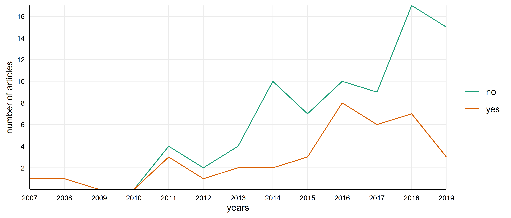
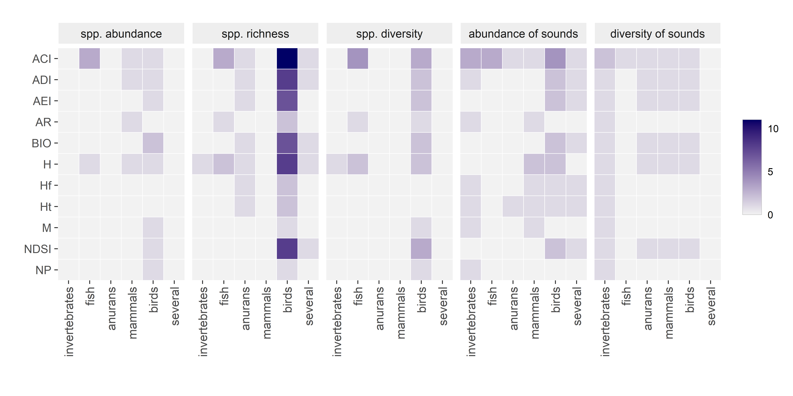
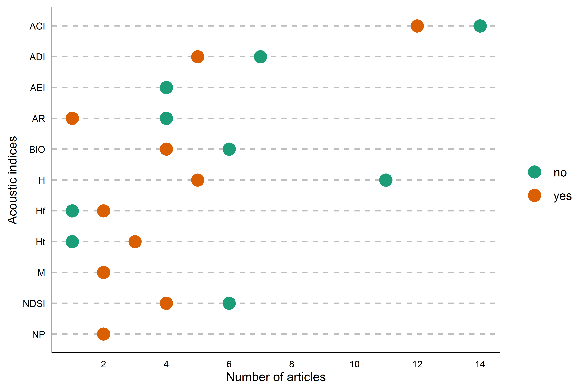

   
<script src="src/hide_output.js"></script>

---

```{r, include = FALSE}
    knitr::opts_chunk$set(cache = FALSE, warning = FALSE, message = FALSE)
```

```{r, warning = FALSE, message = FALSE, results = "hide", cache = FALSE}
    require(knitr)
    require(png)
    require(dplyr)
    require(stringr)
    require(metafor)
    require(compute.es)
    require(kableExtra)
    require(pander)
    require(ggplot2)
    require(RColorBrewer)
  
    source("src/acoustic_indices_functions.R")
```

This web page is a detailed description of the procedures followed to conduct the systematic review and meta-analysis. Our aim was to evaluate the performance of the commonly used acoustic indices as proxies for biodiversity. The repository used to create this document can be found here: https://github.com/irene-alcocer/Acoustic-Indices 

# Systematic review

We extensively searched existing literature for studies assessing the use of acoustic indices as proxies for biodiversity. The systematic search proceeded as follows:

1. We compiled studies that used acoustic diversity indices from three recent literature reviews on acoustic indices, biodiversity assessment and passive acoustic monitoring (i.e., @sueur2014acoustic; @buxton2018efficacy; @sugai2019terrestrial). 
2. We updated the literature database from 2017 up to July 2019 with Thompson’s ISI Web of Science (WoS), querying the database for the keywords (i.e. bioacoustic∗ AND ind∗, ecoacoustic∗, acoustic∗ AND biodiversity, soundscape AND ecology). This search was restricted to 9 WoS subject areas (i.e., zoology, environmental sciences ecology, behavioural sciences, biodiversity conservation, marine freshwater biology, acoustics, evolutionary biology, entomology, and remote sensing).
3. Additionally, we used Google Scholar to compile all literature from 2017 to July 2019 that (i) cited any of these new papers published within this period or (ii) cited the papers originally describing the 11 selected indices (see Table 2 on the manuscript). 

Both peer-reviewed and no peer-reviewed studies were included to avoid publication bias.

After removing all duplicates, we gathered a total of 1,079 studies.(*See Figure 2 in manuscript*).

## Inclusion criteria
We considered studies eligible for meta-analysis if they met the following inclusion criteria:

 (i)	reported data to test the efficiency of acoustic diversity indices as indicators of biodiversity.  
(ii)  employed at least one of the selected acoustic indices (ACI, ADI, AEI, AR, BIO, H, Hf, Ht, M, NDSI, NP).  
(iii)  employed at least one of these five metrics to describe biodiversity, namely species abundance, species richness, species diversity (i.e., Shannon index, Simpson index, and Pielou's evenness), abundance of sounds, and diversity of sounds; and  
(iv)  provided statistical or graphical information of a univariate relationship between a single acoustic index and a single diversity metric.

Following such inclusion criteria, we screened all selected studies (n = 1,079) based on their abstract, titles and keywords and thereby retaining 142 studies which were identified as potentially eligible. To ascertain their relevance, we conducted a full-text assessment on all these studies, finally retaining 35 studies that passed through all the criteria. 

```{r temporal.evo}

```
<div id="fig-caption">
  <b>Figure X -</b> Temporal evolution (2007 – 2019) of the validation data from the total of 142 articles. Articles which correlate the acoustic indices with real biological data are represented with an orange line and studies which do not correlate with a green line
</div>

## Data extraction

*Main extracted data*  

For each study:

- We retrieved the acoustic diversity indices calculated and related to biological diversity.
- We classified the diversity estimates that were measured and related to acoustic indices into five types:**Species Abundance**, number of individuals of a single or several species;**Species richness**, number of vocal and/or non-vocal species;**Species diversity**, including more complex diversity indices that also consider species abundance (i.e., Shannon index, Simpson index or species evenness);**Abundance of sounds**, number of sounds by identified or not identified species;**Diversity of sounds**, number of sounds types by identified or not identified species.
- We described the method applied to obtain such biological information based on two variables: **Acoustic**, data extracted from audio recordings; **Non-acoustic**, data extracted from sources other than recordings, i.e., literature, field surveys, etc.
- We included the environment type: **Terrestrial** and **Aquatic**.
- And studied taxonomic groups: **invertebrates**, **fish**, **anurans**, **mammals**, **birds** or **several**. 

*Handling of pseudoreplication*  

To account for differences in sampling effort among studies and to support the detection of cases of pseudoreplication (i.e., inadequate specification of the number of independent observations when applying statistical analysis) that might potentially lead to biased statistical tests, we extensively assessed the sampling design and statistics of each study. We identified eight features that summarized both spatial and temporal sampling and statistical tests of all the selected articles. When a mismatch between sample size and the number of true replicates was identified, we classified the analysis as using inflated replication and used true replicates as our sample size for meta-analysis (see methods- Sampling design and pseudoreplication in the manuscript and Supplementary Table 1).

### Feature extraction

<div id="fig-caption">
  <b>Supplementary Table 2 -</b> List of the 35 features used to characterize studies that tested the relationship between acoustic indices and diversity metrics.
</div>
```{r data_features_table}
feature_rows <- c(5, 4, 4, 4, 6, 11)
categories <- c("Publication", "Biological data", "Acoustic data", "Recording",
                "Sampling design", "Statistics")
features <- c("Authors", "Title", "Journal", "Year of publication", "Peer reviewed",
              "Environment", "Taxonomic group", "Diversity metric", "Diversity source",
              "Acoustic index", "Frequency range", "FFT size", "Noise treatment",
              "Sampling rate", "Audio format", "Recording length", "Recording method",
              "Study sites", "Distance between sites", "Recorders per site", "Recording days",
                "Daily period", "Daily sample",
              "Statistical test", "Independence", "R${^2}$", "r", "b", "t-statistic",
                "Standard error", "Sample size", "Pseudoreplication", "Pseudoreplication type",
                "Adjusted sample size")
descript_publ <- c("", "", "", "", "Whether the study was subjected to peer review (Yes or No)")
descript_bio_data <- c("Ecosystem type where recordings were collected (aquatic or terrestrial)",
                       "Primary studied group (invertebrates, fish, anurans, mammals, birds, or several)",
                       "Species abundance, species richness, species diversity, abundance of sounds, or diversity of sounds",
                       "Method applied to obtain the diversity metric (acoustic or non-acoustic)")
descript_acous_data <- c("ACI, AEI, ADI, AR, BIO, H, Ht, Hf, M, NP, or NSDI",
                         "Range (in Hz) used for index calculation",
                         "Window size of the Fast Fourier Transformation (FFT)",
                         "Audio pre-processing related to noise (noise filtering, noise addition, or exclusion of noisy recordings)")
descript_rec <- c("Number of audio samples per second (in kHz) used for index calculation",
                  "Format of audio files (.wav, .mp3, etc.)",
                  "Length of each recording (in seconds) used for index calculation",
                  "Non-programmed (continuous), programmed (periodic) or manual (by an operator)")
descript_sampling <- c("Number of study sites (= spatial replicates)",
                       "Minimum distance between study sites (in meters)",
                       "Number of recording units per study site",
                       "Number of recording days per study site (= temporal replicates)",
                       "Period recorded within the day (dawn, morning, midday, evening, dusk, night, or all day)",
                       "Number of recordings collected within a day per study site")
descript_stats <- c("Statistical analysis used to test the relationship between acoustic indices and diversity metrics",
                    "Whether the statistical test was considered independent from other tests of the same study ",
                    "Coefficient of determination (for regression analysis)",
                    "Correlation coefficient (for Pearson or Spearman correlation)",
                    "Regression coefficient (for linear regression analysis)",
                    "Statistic value for Student’s t-test",
                    "Standard error of the test coefficient",
                    "Number of observations included in the statistical test",
                    "Inadequate specification of the number of true replicates in the statistical test (Yes or No)",
                    "Spatial, temporal, or spatial-temporal pseudoreplication",
                    "Suitable specification of the number of true replicates (for pseudoreplicated studies)")
descriptions <- c(descript_publ, descript_bio_data, descript_acous_data,
                  descript_rec, descript_sampling, descript_stats)
features_tbl <- data.frame(Category = rep(categories, feature_rows),
                           Features = features,
                           Description = descriptions)
kbl(features_tbl, format = "html") %>%
   #kable_styling(latex_options = c("scale_down", "HOLD_position")) %>%
   row_spec(0, font_size = 16, bold = TRUE) %>%
   column_spec(1, bold = TRUE) %>%
   column_spec(2, extra_css = 'vertical-align: top !important;') %>%
   collapse_rows(columns = 1, valign = "top") %>%
   row_spec(c(1:5, 10:13, 18:23), background = "#eeeeee") %>%
   kable_classic()
```


## Effect size calculation

We used Pearson’s correlation coefficient (r), as our measure of effect size. The effect size describes the direction and magnitude of the relationship between acoustic indices and diversity metrics.

When Pearson’s correlation, r, was not reported, we extracted other statistics, using the following precedence: Spearman’s correlation, t-values, F-values, linear regression slope coefficients and R². When only graphical information was available, we extracted the statistics with *Web Plot Digitizer v4.2.* [@rohatgiwebplotdigitizer] and computed Pearson correlations.  We converted all statistics to r, using *compute.es* package in R [@del2012package] or when the package did not provide the needed functions we followed the formulas provided in  @nakagawa2007effect and @koricheva2013handbook. 

We converted our effect size r to Fisher’s Z in order to satisfy the normality assumption of parametric meta-analysis [@nakagawa2007effect]. Fisher’s Z values were converted back to r, to ease interpretation of results. 

## Dataset

We collected a total of 481 effect sizes from 35 studies. For the meta-analysis, these number was reduced to 364 effect sizes and 34 studies, after computing composite effect sizes between non-independent effect sizes and removing a study due to difficulty in describing the study design. For the literature review, we kept the original 35 studies.

<div class="fold o">
```{r tidydata}
    df_raw <- read.csv("data/Table.S1.csv")
    n_used <- "n_adjusted"
    # Use n_adjusted as sample size
    df_tidy <- tidy_data(df_raw, n_used)
    # Studies database
    studies <- read.csv("data/Table.S2.csv")
    df_tidy <- merge(df_tidy, studies, by.x = "id", by.y = "ID", all.x = TRUE)
    df_tidy <- df_tidy %>% 
               mutate(authors = paste(Authors, year)) %>%
               select(id, entry, authors, everything(), -Publ_year, -Title,
                      -doi, -Authors) 
```
</div>

<div id="fig-caption">
  <b>Supplementary Table 1 -</b> Complete dataset used in meta-analysis.
</div>
```{r dataset}
kable(df_tidy, format = "html") %>%
     kable_styling(bootstrap_options = c("striped", "hover", "condensed")) %>%
     scroll_box(height = "400px", width = "100%")
```
<br>

<div id="fig-caption">
  <b>Supplementary Table 2 -</b> Variable descriptions for Supplementary Table  1.
</div>
```{r variable_description}
vd <- data.frame(Variables = c("id", "entry", "year", "impact_factor", "index",
                               "taxa", "environ", "bio", "diversity_source", "pseudoreplication",
                               "n", "z", "var", "journal"),
                 Descriptions = c(
                      "Identification number for the study",
                      "Identification number for the effect size (row entry)",
                      "Year of publication",  
                      "Impact factor of the Journal",
                      "Acoustic index used",
                      "Studied taxonomic group studied  (invertebrates, fish, anurans, mammals, birds or several)",
                      "Studied environment (i.e., ecosystem type where recordings were collected: *aquatic* [A] or *terrestrial* [T]",
                      "Diversity metric used to correlate with acoustic index values",  
                      paste("Method applied to obtain the diversity metric: audio recordings (*acoustic*) or other sources (field surveys, literature, etc.; *non-acoustic*)"),
                      paste("Inadequate specification of the number of observations in the statistical test (Yes/No)"),  
                      "Adjusted sample size (i.e., suitable specification of the number of true replicates)",
                      "Fisher's Z effect size",
                      "Fisher's Z variance",
                      "Journal where the study was published"
             ) 
           )
pander(vd, justify = "left")
```

## Dataset overview

In what follows, we provide an overview of the dataset mostly presented within tables and figures.

Our dataset comprised a total of 34 studies and 364 effect sizes. Therefore, most studies contributed with more than one effect size for the meta-analysis.

<div id="fig-caption">
  <b>Supplementary Table 3 -</b> Number of effect sizes collected from each of the 34 studies included in the meta-analysis. ID corresponds to the study identification number in our dataset.
</div>
```{r samplesizes_tables_studies}
studies_n <- as.data.frame(table(df_tidy$id), stringsAsFactors = FALSE)
studies_n <- cbind(unique(df_tidy$authors), studies_n)
colnames(studies_n) <- c("Study", "ID", "Effect_sizes")
studies_n <- studies_n %>%
              select(ID, Study, Effect_sizes) %>%
              arrange(-Effect_sizes)

kable(studies_n, format = "html") %>%
  kable_styling(c("striped"))
```

<br>

The most studied acoustic index was ACI and the most used biodiversity metric was species richness.

<div id="fig-caption">
  <b>Supplementary Table 4 -</b> Number of effect sizes and studies per moderator levels.
</div>
```{r samplesizes_tables_moderators}
# Table for moderator levels
mods <- c("index", "bio", "diversity_source", "environ")
sample_sizes <- do.call(rbind, lapply(mods, function(x) n_studies_entries(df_tidy, x)))

# Format output
sample_sizes <- cbind(row.names(sample_sizes), sample_sizes)
sample_sizes <- as.data.frame(sample_sizes)
names(sample_sizes) <- c("Moderator_levels", "Effect_sizes", "Studies")
sample_sizes$Moderator_levels <- final_mod_names(sample_sizes$Moderator_levels)
sample_sizes$Moderator_levels <- str_replace(sample_sizes$Moderator_levels, "^([a-z])", toupper)
n_row <- nrow(sample_sizes)
sample_sizes$Moderator_levels[(n_row - 1):n_row] <- c("Aquatic", "Terrestrial")

names(sample_sizes) <- str_replace(names(sample_sizes), "_", " ")
kable(sample_sizes, format = "html", row.names = FALSE) %>%
    kable_styling("striped", full_width = FALSE, position = "left") %>%
    row_spec(0, font_size = 16, bold = TRUE) %>%
    pack_rows("Acoustic indices", 1, 11) %>%
    pack_rows("Biodiversity metrics", 12, 16) %>%
    pack_rows("Diversity source", 17, 18) %>%
    pack_rows("Environment", 19, 20)
```

### Visual description of eligible studies

We gathered studies from 6 of the 7 continents (no studies in Antarctica). 
Most studies were conducted in the USA, France, Australia and Brazil.

```{r map}
knitr::include_graphics("rmd/mapa.png")
```
<div id="fig-caption">
  <b>Supplementary Figure 2 -</b> The geographic distribution of the study sites corresponding to the 35 studies used in the literature review. The colouring of countries exhibits a white to black gradient relative to an increase in the number of studies contributed by each country. The coloured dots discriminate between different groups of studied taxa.
</div>

<br>

The performance of acoustic diversity indices as a biodiversity indicators was mainly assessed with species richness and abundance of sounds as diversity metrics, mainly on birds. 
```{r heatmap}

```
<div id="fig-caption">
  <b>Supplementary Figure 3 -</b> Distribution of the number of articles by diversity metric, taxa and acoustic index studied, from the 35 studies included in the literature review.
</div>

<br>

A large set of studies (40%) exhibited statistical deficiencies in testing the relationship between acoustic indices and diversity metrics due to pseudoreplication.
```{r ps.index, out.width = "70%", out.height = "70%", fig.align = "center"}

```
<div id="fig-caption">
  <b>Supplementary Figure 4 -</b> Pseudoreplication summary. The data is representing the total number of articles for each index. Color orange represents number of pseudo-replicated studies and green non pseudo-replicated studies. The article (Papin et al., 2019b) was withdrawal from the pseudoreplication analysis due to impossibility of obtaining the pseudoreplication data causing some variation on the total number of each acoustic index..
</div>


# Meta-analysis

We clustered effect sizes within their corresponding studies and conducted multilevel meta-analysis using Fisher’s Z as our response variable. The multilevel structure accounted for the correlation structures within studies and thus allowed the inclusion of multiple effect sizes per study. 

## Summary effect size

We tested whether acoustic indices were good estimators of biodiversity by computing an intercept-only model. The resulting summary effect size not only gives a clue of whether acoustic indices are performing well in estimating biodiversity across the literature, but also allows us to check if there is substantial heterogeneity in our effect sizes that could be explained by moderators.

*Intercept-only meta-analysis output*
<div class="fold o">
```{r meta_overall}
res_main <- rma.mv(z, var, random = ~1 | id/entry, data = df_tidy)
res_main
```
</div>

<div id="fig-caption">
  <b>Supplementary Table 5 -</b> Resulting estimates from intercept-only model converted to Pearson's correlation. "Estimate" is the Pearson's r summary effect size. "CI.lb" and "CI.ub" are the confidence intervals lower and upper bounds, respectively.
</div>
```{r meta_overall_r, }
r_main <- sapply(c(r = res_main$b, CI.lb = res_main$ci.lb, CI.ub = res_main$ci.ub), z2r)
r_main_pander <- r_main
names(r_main_pander) <- c("Estimate", names(r_main)[2:3])
pander(r_main_pander)
```

The summary estimate indicates that acoustic indices showed a moderate correlation with diversity metrics. However, this result shows differences in performance between acoustic indices or context-dependencies due to, for example, different environments or diversity metrics. For this, we would need to inspect moderators, although it is necessary to check before if our intercept-only model has unexplained variance that can be partitioned by our chosen moderators. 

### Effect sizes in ascending order

The amount of heterogeneity in effect sizes can be coarsely inspected by plotting all effect sizes and respective variances, and see their dispersion along the x-axis.

```{r forest_plot_all, fig.height = 12, fig.align = "center"}
df_all_plt <- mutate(df_tidy, z = z2r(z), var = z2r(var))
r_main <- as.data.frame(t(r_main))
nudge <- 2
overall_y <- -nudge - 1
ggplot(data = df_all_plt, aes(x = z, y = reorder(entry, -z))) + 
    geom_errorbarh(aes(xmin = z - 1.96 * var, xmax = z + 1.96 * var),
                   height = 0, size = 0.5, color = "grey", 
                   position = position_nudge(y = nudge)) + 
    geom_point(size = 0.8, color = "darkgreen", 
               position = position_nudge(y = nudge)) +
    geom_segment(aes(x = z2r(res_main$b), y = overall_y, 
                     xend = z2r(res_main$b), 
                     yend = nrow(df_all_plt) + nudge + 10), 
                     color = alpha("forestgreen", 0.7), linetype = 2, size = 0.5) +   
    geom_vline(xintercept = 0, linetype = 1) +
    # Insert overall estimate
    geom_errorbarh(aes(xmin = r_main$CI.lb, xmax = r_main$CI.ub, y = overall_y), 
                   color = "grey") +
    geom_point(data = r_main, aes(x = r, y = overall_y), size = 3, color = "forestgreen") +
    geom_hline(yintercept = nudge - 1, color = alpha("black", 0.5), linetype = 5, size = 1) + 
    annotate("text", x = -1.4, y = overall_y, label= "Overall estimate", size = 4, adj = "right") + 
    scale_y_discrete(expand = c(0.025, 0.01)) +
    xlab("Effect size (r)") +
    ylab("Dataset entries ordered by effect size magnitude") +
    theme_minimal() + 
    theme(axis.text.x = element_text(size = 12, color = "black"),
          axis.text.y = element_blank(),
          axis.line.x = element_line(color = "black"),
          axis.line.y = element_line(color = "black"),
          axis.title = element_text(size = 14),
          panel.grid.major.y = element_blank(), 
          legend.position = "none"
    )

```
<div id="fig-caption">
  <b> Figure 5a -</b> Pearson correlation effect sizes (r) in ascending order of magnitude from all dataset entries. Effect sizes higher than 0 (vertical line) represent a positive correlation between acoustic indices and diversity. Effect sizes below 0 indicate a negative correlation between acoustic indices and diversity. The green circles above the dashed horizontal line, are effect sizes means and the grey horizontal lines are the corresponding 95% confidence intervals. Below the dashed line is the summary effect size (green circle) and the corresponding 95% confidence interval (grey horizontal lines) obtained after running the intercept-only model.
</div>


### Check heterogeneity

We quantified heterogeneity with the I² statistic, which estimates the proportion of unknown variation in effect sizes not attributed to sampling error variance. 

<br> 

<div id="fig-caption">
  <b>Supplementary Table 6 -</b> Unaccounted heterogeneity of the intercept-only model as measured by I^2^ statistic. Within study heterogeneity (level 2) corresponds to the unaccounted variation that is found on effect sizes within studies, and between study heterogeneity corresponds to the unaccounted variation between studies (level 3).
</div>
```{r meta_hetero}
font_css <- "font-family: Arial"
Is <- multilevel_I(res_main) * 100
Is_df <- data.frame(Is[1], Is[2])
names(Is_df) <- c("Within study", "Between study")
rownames(Is_df) <- c("% Unexplained variation")
total_I <- paste("Total heterogeneity: ", round(Is[1] + Is[2], 2), "%")
header <- c(3)
names(header) <- c(total_I)
kable(Is_df, format = "html", digits = 2) %>%
  kable_styling(c("striped", "bordered"), full_width = FALSE, 
                position = "center") %>%
  add_header_above(header, font_size = 16, bold = TRUE,
                   extra_css = font_css) %>%
  row_spec(0, font_size = 14, extra_css = font_css) %>%
  row_spec(1, font_size = 12, align = "center")
```


```{r dmetar_I, fig.align = "center"}
mlm.variance.distribution(res_main)
```
<div id="fig-caption">
  <b>Supplementary Figure 5 -</b> Visual representation of how variance was distributed over the multilevel structure of the intercept-only model. Within study heterogeneity (level 2) corresponds to the unaccounted variation that is found on effect sizes within studies, and between study heterogeneity corresponds to the unaccounted variation between studies (level 3).
</div>

<br>

The value of I^2^ = 85% corresponding to the amount of heterogeneity that remains unaccounted for in the intercept-only model, gives a green signal to proceed with the use of moderators that can potentially explain some of this variation. 

## Analysis of moderators
We extended the previous intercept-only model with the inclusion of moderators as fixed factors. For these analyses, all moderator levels with less than 5 studies were excluded as low study sizes are more liable to produce biased estimates. This led to the removal of the acoustic indices ‘Hf’, ‘Ht’, ‘M’ and ‘NP’, and the diversity metric ‘diversity of sounds’ from model fitting procedures. 
    
### Sub-group analysis

We conducted sub-group analysis with acoustic index as a moderator to assess which acoustic indices best correlate with biodiversity. 

To specifically test whether the effect size estimates from each acoustic index were different from zero we removed the model intercept.

<div class="fold o">
```{r df_meta_indices}
df_indices <-  clear_moderators(df_tidy, "index")
```
</div>

*Meta-analysis output with acoustic indices as moderator and no intercept.*
<div class="fold o">
```{r meta_indices}
res_indices <- rma.mv(z, var, random = ~ 1 | id/entry, mods = ~ index - 1, data = df_indices)
res_indices
```
</div>


<div id="fig-caption">
  <b>Supplementary Table 7 -</b> Resulting estimates from sub-group analysis. The 'Estimate' column is the Pearson correlation effect size; SE is the standard error and CI.lb and CI.up; and the lower and upper bounds of the confidence intervals, respectively.
</div>
```{r meta_indices_tbl, align = "center"}
df_pred_indices <- get_predictions(res_indices, intercept = FALSE)
df_pred_indices$coef <- str_remove(df_pred_indices$coef, "index")
names(df_pred_indices) <- c("Index", "Estimate", "SE", "CI.lb", "CI.ub")
pander(df_pred_indices)

```


```{r indices_forest_plot}
nentries_index <- rowSums(table(df_indices$index, df_indices$id))
nstudies_index <- rowSums(ifelse(table(df_indices$index, df_indices$id) > 0, 1, 0))
n_index <- paste0(nentries_index, " (", nstudies_index, ")")

df_indices_plt <- data.frame("index" = names(nstudies_index),
                             "es" = z2r(res_indices$beta), 
                             "se" = z2r(res_indices$se), 
                             "ci.lb" = z2r(res_indices$ci.lb),
                             "ci.ub" = z2r(res_indices$ci.ub),
                             "n" = nstudies_index)

ggplot(data = df_indices_plt, aes(x = es, y = index)) + 
    geom_point(aes(color = index), size = 4) +
    geom_errorbarh(aes(xmin = ci.lb, xmax = ci.ub, color= index),
                   height = 0) + 
    geom_vline(xintercept = 0, linetype = 1) +
    geom_vline(xintercept = z2r(res_main$b), color = "forestgreen", 
               linetype = 2) + 
    scale_y_discrete(limits = rev(df_indices_plt$index)) +
    scale_color_brewer(palette="Dark2") +
    theme_minimal() + 
    xlab("Effect size (r)") +
    theme(axis.text.x = element_text(size = 12, color = "black"),
          axis.text.y = element_text(size = 13, color = "black"),
          axis.line.x = element_line(color = "black"),
          axis.line.y = element_line(color = "black"),
          axis.title.x = element_text(size = 14),
          axis.title.y = element_blank(),
          legend.position = "none"
    )
   
```
<div id="fig-caption">
  <b>Figure 5b -</b> Effect size mean estimates (circles) and corresponding 95% confidence intervals (horizontal lines) obtained from sub-group meta-analysis with acoustic indices as the grouping factor. Estimated effect sizes whose 95% confidence intervals do not overlap zero (black vertical line) indicate a positive correlation between acoustic indices and diversity if they are to the right of zero, or a negative correlation if they are to the left of zero. The dashed green vertical line represents the summary effect size obtained from the intercept only meta-analysis.
</div>

<br>

### Meta-regression

We used meta-regression to check the effect of multiple moderators on the ability of acoustic indices to estimate biodiversity. We focused on four moderators that could alter the performance of biodiversity estimation, namely:

1. Acoustic index - which acoustic index was used to estimate biodiversity. 
2. Diversity metrics – which metric of diversity was used to check the performance of acoustic index.
3. Environment – if recordings were done in aquatic or terrestrial environments; 
4. Diversity source – if the diversity metric was obtained from acoustic (examination of sound recordings) or non-acoustic sources (e.g., field surveys).

We set as intercept the following combination of moderator levels: ACI index, species richness, terrestrial environment and non-acoustic data source.  

Due to low study sample size between most factor level combinations, we were constrained to use only an additive effects model.  

<div class="fold o">
```{r df_meta_regression}
mods <- c("index", "bio", "environ", "diversity_source")
df_full <- clear_moderators(df_tidy, mods)
```
</div>

*Meta-analysis with acoustic indices, biodiversity metrics, environment and diversity source as moderators.*
<div class="fold o">
```{r meta_regression}
res_full <- rma.mv(z, var, random = ~1 | id/entry, 
                   mods = ~ index + bio + environ + diversity_source, 
                   data = df_full)
 
res_full
```
</div>

<br>

#### **Multicollinearity**

Multicollinearity among our moderators was inspected with VIF and found not to be an issue in our model (VIF < 1.7 for all moderators, threshold value of 3 [@zuur2010protocol].

<div id="fig-caption">
  <b>Supplementary Table 8 -</b> VIF values obtained for each moderator level.
</div>
```{r collinearity}
vif_meta <- vif.rma(res_full, table = TRUE)$vif["vif"][-1, , drop = FALSE]
vif_meta <- tibble::rownames_to_column(vif_meta, "Moderators")
colnames(vif_meta)[2] <- "VIF" 
vif_meta$VIF <- round(vif_meta$VIF, 3)
vif_meta$Moderators <- str_remove(vif_meta$Moderators, "index|bio|environ|diversity_source")
vif_meta$Moderators <- final_mod_names(vif_meta$Moderators)
pander(vif_meta)
```

<br>

#### **Heterogeneity full model**

Substantial heterogeneity remained to be explained after fitting the full model. Therefore, other factors not tested or an interaction among our moderators could have the ability to extract even more information from the dataset. For the latter, an increase in available studies on the correlation between acoustic indices and biodiversity is of the utmost important.

<div class="fold o">
```{r heterogeneity_full_model}
# Fit overall model with df_full (without levels with less than 5 studies)
res_main_full <- rma.mv(z, var, random = ~1 | id/entry, data = df_full)
sum_I_main_full <- sum(multilevel_I(res_main_full))
sum_I_full <- sum(multilevel_I(res_full))

cat("Heterogenity after fitting the full model\n\t", sum_I_full, "\n\n",
    "Difference heterogeneity between intercept only model and full model\n\t",
    sum_I_main_full - sum_I_full)


```
</div>

<br>

#### **Full model results**

<div id="fig-caption">
  <b>Supplementary Table 9 -</b> Table used to plot Supplementary Figure 6. Each estimate corresponds to the additive effect when a moderator level is replaced in the intercept (e.g. ADI is the additive effect of ADI when ADI is put as intercept instead of ACI). The column "Coefficients" lists the model intercept and the levels of each moderator. The column "Estimate" is the estimated Pearson (r) correlation. "SE" is the standard error of the estimate. "CI" are the [lower] [upper] bounds of the confidence intervals.
</div>
```{r mod_level_estimates}
df_pred_tbl <- get_predictions(res_full, format_table = TRUE, clean_labels = TRUE)
df_pred_tbl$Coefficients <- final_mod_names(df_pred_tbl$Coefficients)
pander(df_pred_tbl)
```


```{r mod_level_estimates_plt, fig.width = 10, fig.height = 8}
df_pred <- get_predictions(res_full)
colnames(df_pred) <- tolower(str_remove(colnames(df_pred), "\\s.*"))
df_pred$moderators <- df_pred_tbl$Moderators
df_pred$coef <- factor(df_pred_tbl$Coefficients, 
                       levels = rev(df_pred_tbl$Coefficients))

plt_colors <- c("#000000", brewer.pal(n = 4, name = "Dark2"))
ggplot(data = df_pred, aes(x = z2r(estimate), y = coef, 
                           color = moderators)) + 
    geom_point(size = 3) +
    geom_errorbarh(aes(xmin = ci.lb, xmax = ci.ub), height = 0, size = 1) +
    geom_vline(xintercept = 0, linetype = 1) + 
    scale_color_manual(values = plt_colors, name = "Moderators") + 
    theme_minimal() + 
    xlab("Effect size (r)") +
    theme(axis.text.x = element_text(size = 13, color = "black"),
          axis.text.y = element_text(size = 13, color = "black"),
          axis.line.x = element_line(color = "black"),
          axis.line.y = element_line(color = "black"),
          axis.title.y = element_blank(),
          axis.title.x = element_text(size = 14),
          panel.grid.major.y = element_blank(),
          legend.title = element_text(hjust = 0.5, size = 14),
          legend.text = element_text(size = 14)
    )


```
<div id="fig-caption">
  <b>Supplementary Figure 6 -</b> Mean estimates (circles) and corresponding 95% confidence intervals (horizontal lines). Moderators are acoustic indices (Index), biodiversity metrics (Bio), environment (Environment) and acoustic source (Source). Each estimate corresponds to the additive effect when a moderator level is replaced in the intercept (e.g. ADI is the additive effect of ADI when ADI is put as intercept instead of ACI). Estimated effect sizes whose 95% confidence intervals do not overlap zero (black vertical line) indicate a positive correlation between acoustic indices and diversity if they are to the right of zero, or a negative correlation if they are to the left of zero.
</div>

<br>

#### **Test of moderators**

We checked if our choice of moderators explained some of the variation in our effects sizes by  computing a Wald-type test on the null hypothesis that moderator levels' estimates are jointly equal to zero [@viechtbauer2015comparison]. 

<div id="fig-caption">
  <b>Supplementary Table 10 -</b> Wald-type tests for all moderators (first row), and for each moderator separately (remaining rows). "Q" is the Wald statistic; "df" are the degrees of freedom; and "p" is the probability that moderator estimates came from a chi-square distribution, where all estimates are equal to zero. Thus, a p-value < 0.05 gives support against the null hypothesis that moderator levels estimates are equal to zero (i.e. they do not explain variation in effect sizes).
</div>
```{r test_moderators}
imp_mods <- matrix(nrow = length(mods) + 1, ncol = 4, 
                   dimnames = list(NULL, c("Moderator", "Q", "df", "p")))
imp_mods <- as.data.frame(imp_mods)
# Add importance of all moderators
imp_mods[1, 2:ncol(imp_mods)] <- res_full[c("QM", "m", "QMp")]
imp_mods$Moderator[1] <- "All moderators"

for(i in 2:nrow(imp_mods)){
  wald_test <- anova(res_full, 
                     btt=grep(mods[i - 1], rownames(res_full$b)))[c("QM", "m","QMp")]
  imp_mods[i, 2:ncol(imp_mods)] <- wald_test
}
imp_mods$Moderator[2:nrow(imp_mods)] <- c("Acoustic indices", 
                                          "Diversity metrics", 
                                          "Environment", "Diversity source")
imp_mods <- mutate_if(imp_mods, is.numeric, round, 3)

pander(imp_mods)
```

We found that the acoustic indices explained most of the variation in our full model. Hence, this suggests that acoustic indices are not equally performing when it comes to estimate biodiversity. 

<br>

#### **Difference between moderator levels**

To assess pairwise comparisons between moderator level estimates, we selected the moderator levels with the highest effect size estimates and compared these with effect size estimates for the other levels of the same moderator. For this, we used again a Wald-type test with one degree of freedom, on the null hypothesis that the difference between the two levels is equal to zero. Note that, if a moderator has only two levels, the comparison is directly retrieved from the model output. 

##### **Acoustic indices pairwise comparisons** {.tabset .tabset-pills}

We compared the best indices, H and NDSI, with the other indices. We did not use ACI for comparisons, as comparisons can be obtained directly from the full model output.

###### H index

The pairwise comparisons for H index suggest that the H index correlates better with biodiversity than the indices ADI, AEI, AR and BIO. 

<br>

<div id="fig-caption">
  <b>Supplementary Table 11 -</b> Wald-type tests for the contrasts between acoustic index H with all other acoustic indices. The column "Compared" expresses the difference between the estimate H and the estimate of each of the other acoustic indices. The column "Estimate" is the estimate obtained from the difference expressed in the previous column; "SE" is the standard error of the difference, and CI.lb, CI.up the confidence interval lower and upper bound, respectively; "QM" is the Wald statistic; "p" is the probability that the difference between estimates is equal to zero. Thus, a p-value < 0.05 gives support against the null hypothesis of no difference between the estimate of the H index and the estimate of the other index.
</div>
```{r compare_indices_H}
# Test differences between H and other indices
H_comp <- compare_moderators(df_full, res_full, "index", "H")
kable(H_comp, format = "html", digits = 3) %>%
  kable_styling(c("strip", "condensed"))

```

###### NDSI index

The pairwise comparison for NDSI index suggest that the NDSI index correlates better with biodiversity than the indices AEI and AR. 

<br> 

<div id="fig-caption">
  <b>Supplementary Table 12 -</b> Wald-type tests for the contrasts between acoustic index NDSI with all other acoustic indices. The column "Compared" expresses the difference between the estimate NDSI and the estimate of each of the other acoustic indices. The column "Estimate" is the estimate obtained from the difference expressed in the previous column; "SE" is the standard error of the difference, and CI.lb, CI.up the confidence interval lower and upper bound, respectively; "QM" is the Wald statistic; "p" is the probability that the difference between estimates is equal to zero. Thus, a p-value < 0.05 gives support against the null hypothesis of no difference between the estimate of the NDSI index and the estimate of the other index.
</div>
```{r compare_indices_NDSI}
# Test differences between NDSI and other indices
NDSI_comp <- compare_moderators(df_full, res_full, "index", "NDSI")
kable(NDSI_comp, format = "html", digits = 3) %>%
  kable_styling(c("strip", "condensed"))
```

##### **Biodiversity metrics pairwise comparisons**

Since abundance of sounds measures seemed to be related with a best performance of the acoustic indices ability to correlate with biodiversity, we use abundance of sounds to compute pairwise comparisons with the other diversity metrics.

The pairwise comparison for abundance of sounds gave marginal support (at p < 0.05) for the null hypothesis of no difference between abundance of sounds and other diversity metrics.

<br>

<div id="fig-caption">
  <b>Supplementary Table 13 -</b> Wald-type tests for the contrasts between the diversity metric abundance of sounds with all other diversity metrics. The column “Compared” expresses difference between the estimate abundance of sounds and the estimate of each of the other diversity metrics. The column “Estimate” is the estimate obtained from the difference expressed in the previous column; “SE” is the standard error of the difference, and CI.lb, CI.up the confidence interval lower and upper bound, respectively; “QM” is the Wald statistic; “p” is the probability that the difference between estimates is equal to zero. Thus, a p-value < 0.05 gives support against the null hypothesis of no difference between the estimate of the abundance sounds metric and the estimate of the other metric.
</div>
```{r compare_bio}
# Test difference between sound_abundance and other bio levels
sound_abund_comp <- compare_moderators(df_full, res_full, "bio", "sound_abundance")
sound_abund_comp$Compared <- c("Abundance of sounds - Species abundance",
                               "Abundance of sounds - Species diversity",
                               "Abundance of sounds - Species richness")
kable(sound_abund_comp, format = "html", digits = 2) %>%
  kable_styling(c("strip", "condensed"))
```

<br>

# Publication bias

We assessed publication bias both, visually (with funnel plots) and statistically (with Egger’s regression). 

A funnel plot usually shows the relationship between effect sizes and standard errors. In a symmetric funnel plot, the dispersion of effect sizes should get narrower as standard error decreases. 

Due to the multilevel structure of our dataset, we used meta-analytic residuals instead of effect sizes to reduce the effect of independence assumptions. We should consider publication bias as an issue if residuals are outside the expected symmetry of the funnel shape, and if some of the funnel sections do not contain any residual. 

To statistically test for funnel plot symmetry, we used Egger’s regression with no intercept. A non-significant inverse variance weighted regression of the residuals over the standard error, indicates that the deviation of the residuals from the funnel plot shape is not greater than what would be expected by chance in a symmetric funnel plot. 

```{r eggers_reg}
# Testing model residuals
resid <- rstandard(res_full)
eggers <- regtest(x = resid$resid, sei =sqrt(df_full$var), model = "lm")
```

```{r funnel_plot, fig.width = 10, fig.height = 10}
funnel(res_full, 
       back = "white", 
       xlab = "Model Residuals", 
       ylab = "Std. Error", 
       pch = 21,
       col = "darkblue",
       cex = 1.1,
       lwd = 2
)
# Put eggers regression results on funnel plot
eggers_round <- round(eggers$pval, 2)
plt_text <- paste0("Regression test for plot symmetry \n\t\t  p = ", eggers_round, "\n\n")
legend(legend = plt_text, x = 0.5, y = -0.01, bg = alpha("darkgrey", 0.2))
```
<div id="fig-caption">
  <b>Figure 7 -</b> Funnel plot (dashed triangle) with the relation between model residuals from the meta-regression model, and effect size standard error. Absence of publication bias is represented by a scattered and symmetric distribution of values (blue hollow dots) within the funnel. The box on the top right is the p-value from Egger's regression, which means that we failed to reject the null hypothesis of funnel symmetry (p = 0.53).
</div>

*Output of Egger's regression.*
<div class="fold o">
```{r eggers_fit}
eggers$fit
```
</div>

We could not find strong indications of publication bias. Notwithstanding the visual inspection of the funnel plot shows that there are some gaps in the dispersion of the dots in the funnel plot (special at the top, and at the bottom left corner).

<br>

# Sensibility analysis

## Pseudoreplication

Pseudoreplicated designs were widespread in our selected studies (40% of the articles). Therefore, to determine the influence of effect size estimates from pseudoreplicated studies in our meta-analysis, we contrasted the effect size estimate for pseudoreplicated and non-pseudoreplicated studies. For this we conducted a meta-analysis with pseudoreplication as the single binary moderator and observed if the resulting estimate of the contrast between both type of studies overlapped zero. 

*Meta-analysis with pseudoreplication moderator*
<div class="fold o">
```{r pseudoreplication_moderator}
no_out <- capture.output({
            df_pseudorep <-  clear_moderators(df_tidy, "pseudoreplication")  
          })
  
res_pseudorep <- rma.mv(z, var, random = ~1 | id/entry, mods = ~ pseudoreplication, 
                        data = df_pseudorep)
res_pseudorep
```
</div>

```{r pseudoreplication_boxplot}
ggplot(data = df_pseudorep, aes(x = pseudoreplication, y = z2r(z))) +
  geom_boxplot(aes(color = pseudoreplication)) + 
  geom_jitter(aes(color = pseudoreplication, size = n), width = 0.2, alpha = 0.5) +
  geom_hline(yintercept = z2r(res_main$b), color = "chartreuse4", linetype = 2) + 
  ylab("Effect Size (r)") + 
  xlab("Pseudoreplicated") + 
  scale_color_brewer(palette = "Set1") + 
  scale_x_discrete(labels = c("No", "Yes")) +
  coord_flip() +
  theme_minimal() +
  theme(legend.position = "none",
        axis.text.y = element_text(size = 12, color = "black"),
        axis.text.x = element_text(size = 11, color = "black"),
        axis.title.y = element_text(size = 14),
        axis.title.x = element_text(size = 12),
        axis.line.x = element_line(color = "black")
  )
```
<div id="fig-caption">
<b>Figure 6 -</b> Boxplot comparing effect size mean values of sampling designs considered pseudoreplicated ("Yes" on the vertical axis) against sampling designs not considered pseudoreplicated ("No" on the vertical axis). The circles represent each individual effect size mean value, and the circle size indicates the relative sample size of the effect size. The dashed green vertical line shows the position of summary effect size obtained from the intercept only meta-analysis.
</div>

<br> 

We failed to find differences between the estimates of pseudoreplicated and non-pseudoreplicated designs. Thus, we believe that our adjustment of sample sizes, was a sufficient treatment for pseudoreplication in our meta-analysis.

## Outliers

We visually inspected the presence of outlier studies using Cook’s distance clustered by studies. The Cook's distance for a given study, refers to how far, on average, effect size estimates will move if the study in question is dropped from model fitting [@viechtbauer2010outlier]. 
We considered a study an outlier if its Cook’s distance was higher than the average of all computed Cook’s distances.


### Cook's distance

```{r cooks_dist_study, fig.height = 11}
### Cook's distances for each study!

cooks_dist <- cooks.distance(res_full, cluster=df_full$id)
df_full$id <- as.character(df_full$id)

df_cooks <- data.frame(id = names(cooks_dist), cooks_dist = cooks_dist)

df_cooks <- df_cooks %>% 
              left_join(df_full, by = "id") %>%
              select(id, authors, cooks_dist)
# Remove leading spaces
df_cooks$authors <- str_remove(df_cooks$authors, "^\\s")
df_cooks <- df_cooks %>%
              filter(!duplicated(authors)) %>%
              arrange(authors)

ggplot(data = df_cooks, aes(x = authors, y = cooks_dist, group = 1)) + 
  geom_point(color = "deepskyblue4") +
  geom_line(color = "deepskyblue4") + 
  geom_segment(aes(xend=authors), yend = 0, color = "darkgrey", linetype = 2) + 
  geom_hline(yintercept = mean(cooks_dist), color = "darkred", linetype = 2) + 
  xlab("Studies") + ylab("Cook's Distance") + 
  scale_x_discrete(limits = rev(df_cooks$authors)) + 
  theme_minimal() + 
  theme(
        axis.text = element_text(color = "black"),
        axis.line = element_line(color = "black"),
  ) + 
  coord_flip() 

```
<div id="fig-caption">
<b>Supplementary Figure 7 -</b> Cook's distance values for each study (blue dots) and average Cook's distance over all studies (dashed vertical red line). The Cook's distance for a given study can be interpreted as the distance between the entire set of predicted values once with this study included and once with this study excluded from the model fitting procedure. On the y-axis are the studies identified by first author and year. The x-axis corresponds to the Cook's distance values.
</div>

### Check outlier studies

Here, we examine outlier studies to discriminate possible reasons for their influence.

```{r check_outliers}
outliers <- df_cooks[which(df_cooks$cooks_dist > mean(df_cooks$cooks_dist)), ]$id

df_outliers <- df_full[which(df_full$id %in% outliers), ]

ggplot(data = df_outliers, aes(x = z2r(z), y = id)) + 
  geom_boxplot(aes(color = id), fill = NA, width = 0.3) + 
  geom_jitter(height = 0.1, aes(color = id)) + 
  scale_color_brewer(palette = "Set2") + 
  scale_y_discrete(labels = rev(unique(df_outliers$authors))) + 
  xlab("Effect size (r)") +
  geom_vline(xintercept = z2r(res_main$b), color = "chartreuse4", linetype = 2) + 
  theme_minimal() + 
  theme(
    axis.title.y = element_blank(),
    axis.text.y = element_text(size = 11, color = "black"),
    axis.text.x = element_text(size = 11, color = "black"),
    axis.line.x = element_line(color = "black"),
    legend.position = "none"
  )

```
<div id="fig-caption">
<b>Supplementary Figure 8 -</b> Boxplot and distribution of effect size values (dots) of the two studies identified as outliers. The y-axis identifies the study, and the x-axis corresponds to the Pearson r effect size. The green vertical dashed line is the summary effect obtained in the intercept-only model.
</div>

<br>

Both outlier studies used birds as the organism of study, and assessed multiple acoustic indices (@gage2017acoustic examined ACI, ADI, AEI, BIO, H, NDSI indices; and @mammides2017acoustic examined ACI, ADI, AEI, AR, BIO, H, NDSI indices). The main difference was that @gage2017acoustic used acoustic recordings to get biodiversity measures while @mammides2017acoustic relied on non-acoustic sources of biodiversity information.

The box plots and effect size dispersion, suggest that the study by @gage2017acoustic contributed over dispersed effect sizes values, including some at the lower and higher ends of the Pearson effect size scale [-1, 1]. 

The @mammides2017acoustic study contributed a total 84 effect sizes, also dispersed over a wide range. The number of effect sizes per se (23% of total effect sizes) could be responsible for its high value of Cook's distance.

### Removing outlier studies and examining results

We evaluated the robustness of our results by removing the outliers from the dataset and running the meta-regression model without the outlier studies.  

*Meta-analysis with outliers removed*
<div class="fold o">
```{r no_outliers}
df_no_outliers <- df_full[-which(df_full$id %in% outliers), ]

res_no_outliers <- rma.mv(z, var, random = ~1 | id/entry, 
                   mods = ~ index + bio + environ + diversity_source, 
                   data = df_no_outliers)

res_no_outliers

```
</div>

```{r viz_compare_res_no_outliers}
# With outliers results from full model results 
df_pred$df <- "with_outliers"
# No outliers resuls in dataframe
df_no_outliers_plt <- get_predictions(res_no_outliers)
df_no_outliers_plt$moderators <- df_pred$moderators
df_no_outliers_plt$coef <- factor(df_pred$coef, 
                                  levels = rev(df_pred$coef))
df_no_outliers_plt$df <- "no_outliers"

df_examine_outliers <- rbind(df_pred, df_no_outliers_plt)

plt_colors <- c("skyblue4", "goldenrod3")#"seagreen")
pd <- position_dodge(0.6)
n_rows <- nrow(res_full$b)

ggplot(data = df_examine_outliers, aes(x = estimate, y = coef, color = df, position = df)) + 
    geom_point(position = pd, size = 2.3) +
    geom_errorbarh(aes(xmin = ci.lb, xmax = ci.ub), height = 0, position = pd, size = 0.8) + 
    geom_vline(xintercept = 0, linetype = 1, color = "black") + 
    #scale_y_discrete(labels =  rev(y_labels)) +
    scale_color_manual(values = plt_colors, name = "Dataset", 
                       labels = c("No outliers", "Full dataset")) + 
    geom_hline(yintercept= seq(1, n_rows - 1) + 0.5, linetype = 3, color = "black") + 
    theme_minimal() + 
    xlab("Effect size (r)") +
    theme(axis.text.x = element_text(size = 12, color = "black"),
          axis.text.y = element_text(size = 13, color = "black"),
          axis.line.x = element_line(color = "black"),
          axis.line.y = element_line(color = "black"),
          axis.title.y = element_blank(),
          axis.title.x = element_text(size = 14),
          panel.grid.major.y = element_blank(),
          legend.title = element_text(hjust = 0.5, size = 12),
          legend.text = element_text(size = 11)
    )
```
<div id="fig-caption">
<b>Figure 5c -</b> Contrast of model estimates obtained with meta-regression analysis over the full dataset (yellow) and over the dataset with outliers removed (blue). Estimates are represented with circles and corresponding 95% confidence intervals with horizontal lines. Each estimate corresponds to the additive effect when a moderator level is replaced in the intercept (e.g. ADI is the additive effect of ADI when ADI is put as intercept instead of ACI). Estimated effect sizes whose 95% confidence intervals do not overlap zero (black vertical line) indicate a positive correlation between acoustic indices and diversity if they are to the right of zero, or a negative correlation if they are to the left of zero. We considered outliers every study that had a Cook's distance value higher than the mean of all Cook distances. Model moderators were acoustic indices (ADI, AEI, AR, BIO, H, NDSI, with ACI as intercept), diversity metric (Species abundance, Species diversity, Abundance of sounds, with Species richness as intercept), environment (Aquatic, with Terrestrial as intercept), diversity source (Acoustic, with Non-Acoustic as intercept). The solid vertical black line represents a null effect size.
</div>

<br>

The results are similar with major overlap between confidence intervals, especially for the most conclusive results in the full dataset. It seems that removing outliers tended to generate stronger mean effect size estimates of the correlation between acoustic indices and biodiversity.

*Heterogeneity for the intercept-only model with no outliers*
<div class="fold o">
```{r heterogeneity_no_outliers}
res_main_no_outliers <- rma.mv(z, var, random = ~1 | id/entry, data = df_no_outliers)

Is_no_outliers <- multilevel_I(res_main_no_outliers)

sum(Is_no_outliers)
```
</div>

## Effect size tendencies {.tabset .tabset-pills}

We visually inspected tendencies in the effect size over year of publication, and impact factor of the journal. 

### Publication year

We observed a tendency of effect size values to decrease over the years, which is distinctive from 2007 to 2015. 

```{r effect_size_year}
plt_color <- "darkorchid4"
ggplot(df_tidy, aes(x = year, y = z2r(z))) + 
    geom_jitter(aes(size = n), shape = 21, 
                fill = alpha(plt_color, 0.5), 
                color = plt_color) + 
    geom_hline(yintercept=0, linetype = 2) +
    geom_smooth(method='lm', color = plt_color) +
    labs(y = "Effect size (r)", x = "Publication Year") +  
    scale_x_continuous(breaks = seq(min(df_tidy$year), 
                                    max(df_tidy$year), by = 2)) +
    theme_minimal() +
    theme(
        axis.line.y = element_line(color = "black"),
        axis.text = element_text(color = "black", size = 12),
        axis.title = element_text(color = "black", size = 14),
        legend.position = "none"
    )
```
<div id="fig-caption">
<b>Figure 4a -</b> Relation between effect size mean values (circles) and publication year. Circle size indicates the relative sample size of each effect size. The fitted line is a simple least squares regression with the corresponding 95% confidence interval region in grey. The dashed horizontal line represents an effect size of 0. Effect size mean values are positioned along the publication year axis with minor random noise to reduce overlapping.
</div>

### Publication year > 2015

The tendency continues less pronounced from 2015 to 2019. As our knowledge on acoustic indices progresses, larger limitations on the capacity of these tools to efficiently quantify local biodiversity are revealed. Thus, together with the rapid spread of these indices, additional efforts are required to better understand the significance, interpretation, and efficient use of these indices in biodiversity appraisal (Gasc et al., 2015)

```{r effect_size_year_gt_2015}
df_tidy_after2015 <- df_tidy[df_tidy$year >= 2015, ]

ggplot(df_tidy_after2015, aes(x = year, y = z2r(z))) + 
    geom_jitter(aes(size = n), shape = 21, 
                fill = alpha(plt_color, 0.5), 
                color = plt_color) + 
    geom_hline(yintercept=0, linetype = 2) +
    geom_smooth(method='lm', color = plt_color) +
    labs(y = "Effect size (r)", x = "Publication Year") +  
    scale_x_continuous(limits = c(2015, 2019),
                       breaks = seq(min(df_tidy_after2015$year), 
                                    max(df_tidy_after2015$year), 
                                    by = 1)) +
    theme_minimal() +
    theme(
        axis.line.y = element_line(color = "black"),
        axis.text = element_text(color = "black", size = 12),
        axis.title = element_text(color = "black", size = 14),
        legend.position = "none"
    )
```
<div id="fig-caption">
<b>Figure 4b -</b> Relation between effect size mean values (circles) and publication year after 2015 (inclusive) where there is a sudden and prominent rise of publications. Circle size indicates the relative sample size of each effect size. The fitted line is a simple least squares regression with the corresponding 95% confidence interval region in grey. The dashed horizontal line represents an effect size of 0. Effect size mean values are positioned along the publication year axis with minor random noise to reduce overlapping.
</div>

### Impact factor

Effect size values do not appear to exhibit a tendency when it comes to journal impact factor.

```{r effect_size_impact_factor}
plt_color <- "deeppink4"
ggplot(df_tidy, aes(x = impact_factor, y = z2r(z))) + 
  geom_jitter(aes(size = n), shape = 21, 
              fill = alpha(plt_color, 0.5), 
              color = plt_color,
              width = 0.2) + 
    geom_hline(yintercept=0, linetype = 2) +
    geom_smooth(method='lm', color = plt_color) +
    labs(y = "Effect size (r)", x = "Impact Factor") +  
    theme_minimal() +
    theme(
        axis.line.y = element_line(color = "black"),
        axis.text = element_text(color = "black", size = 12),
        axis.title = element_text(color = "black", size = 14),
        legend.position = "none"
    )
```
<div id="fig-caption">
<b>Supplementary Figure 9 -</b> Relation between effect size mean values (circles) and journal impact factor. Circle size indicates the relative sample size of each effect size. The fitted line is a simple least squares regression with the corresponding 95% confidence interval region in grey. The dashed horizontal line represents an effect size of 0. Effect size mean values are positioned along the impact factor axis with minor random noise to reduce overlapping.
</div>

# Supplementary data

All code files and supplementary data used in the study can be found in [https://irene-alcocer.github.io/Acoustic-Indices/]().

# Session info

```{r session_info}

sessionInfo()

```

# References
